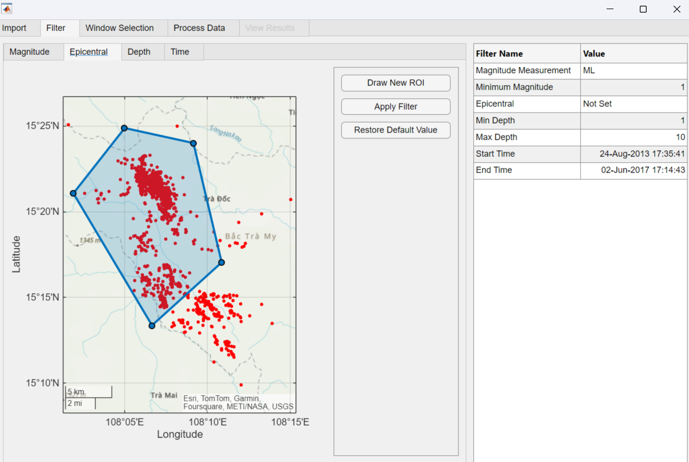

[](https://matlab.mathworks.com/open/github/v1?repo=mathworks/Seismic-HAzard-Parameters-Evaluation-Interface-SHAppE)
[](https://uk.mathworks.com/matlabcentral/fileexchange/180879-shappe-seismic-hazard-parameters-evaluation-interface)

# SHAppE: Seismic HAzard Parameters Evaluation App
***WARNING**: SHAppE is compatible with MATLAB R2025a and newer. If you use an earlier MATLAB release, please select the [SHAppE version V1.0.0](https://github.com/mathworks/Seismic-HAzard-Parameters-Evaluation-Interface-SHAppE/releases/tag/v1.0.0)*

SHAppE is an intuitive interface for time-dependent seismic hazard evaluation, designed to support both researchers and practitioners in natural and anthropogenic seismology.

SHAppE is an interactive MATLAB&reg; app designed for time-dependent seismic hazard analysis. It extends the capabilities of the existing SHAPE toolbox ([Leptokaropoulos and Lasocki, 2020](https://doi.org/10.1785/0220190319)), improving usability through an intuitive graphical interface. SHAppE allows users to explore datasets interactively and evaluate probabilistic changes in seismic hazard parameters, such as mean return periods (MRP) and exceedance probabilities (EP), along with their confidence intervals. SHAppE also produces output figures and reports. Each report documents the specific combination of methods, selected data, and parameter values used in the analysis. This ensures better traceability and simplifies reproducibility for future studies.

{ width=900px }

## Key Features

- **New Interactive Interface**: SHAppE enhances the SHAPE toolbox by providing a graphical interface for improved user experience.
- **User-Friendly Design**: The intuitive layout ensures accessibility for users with limited programming skills.
- **Flexible Data Import & Filtering**: Users can import earthquake catalogues and correlated data (e.g., fluid injection rates, reservoir volume, tidal water levels) and filter by:
  - Time
  - Space
  - Depth
  - Magnitude
- **Multiple Windowing Options**: Users can create time windows based on:
  - Equal time intervals
  - Equal event numbers
  - Graphical selections
  - Imported files
- **Magnitude Distribution Models**: Four models for seismic hazard parameter evaluation are supported:
  - Unbounded Gutenberg-Richter (GRU)
  - Truncated Gutenberg-Richter (GRT)
  - Unbounded Non-Parametric Kernel (NPU)
  - Truncated Non-Parametric Kernel (NPT)
- **Parameter Evaluation**: Users can define the target period, magnitude, maximum magnitude (Mmax), and number of bootstrap iterations for evaluating the confidence interval of the results.
- **Results Export**: Generate comprehensive reports and visualizations of:
  - Original data
  - Filtered data
  - Selected parameters
  - Earthquake occurrence rates and b-values (or mean magnitudes for non-parametric approaches)
  - Mean Return Periods and Exceedance Probabilities with confidence intervals

## Required Products

SHAPE functions are compatible with R2017b or later and require the following:

-   [MATLAB](https://www.mathworks.com/products/matlab.html)
-   [Statistics and Machine Learning Toolbox&trade;](https://www.mathworks.com/help/stats/)
-   [Image Processing Toolbox&trade;](https://uk.mathworks.com/products/image-processing.html)

## 3rd Party Content

- **Original MATLAB Functions for Hazard Analysis**: SHAppE relies on the original MATLAB functions for seismic hazard parameter evaluations available in the SHAPE toolbox repository: https://epos-apps.grid.cyfronet.pl/tcs-ah/sera-applications/src/branch/master/SHAPE_Package/SHAPE_ver2b.0/SSH.
- **Sample data can be downloaded from Thematic Core Service - Anthropogenic Hazards (TCS-AH)** on the Episodes Platform: https://episodesplatform.eu/?lang=en#episode:SONG_TRANH. The dataset includes seismicity records and water level measurements from the Song Tranh 2 reservoir in Vietnam. These data are shared under the Creative Commons Attribution 4.0 International License (CC:BY). We processed the original data in the Sample_Data directory to be compatible with the app. We duplicated the ML as MW in seismic data and Water Level as Pressure in production data for demonstration purposes.

## Installation and Usage

- **Get SHAppE**: You can download or clone SHAppE from GitHub&reg; or download/install from File Exchange.
- **Download SHAPE Functions**: The original SHAPE toolbox will be installed automatically when you install SHAppE into MATLAB. It can also be downloaded from https://epos-apps.grid.cyfronet.pl/tcs-ah/sera-applications/src/branch/master/SHAPE_Package/SHAPE_ver2b.0/SSH to enable SHAppE's functionality.
- **Installation**: Follow the provided instructions to add SHAppE to your MATLAB environment.
- **Data Preparation**: Users may either download sample data or follow provided instructions to retrieve and preprocess data from the TCS-AH platform.
- **Usage Guide**: SHAppE's interface is designed for interactive exploration and parameter evaluation with minimal setup.

## Examples

For further information check the dynamic poster from: 
AGU&reg; 2024: https://agu24.ipostersessions.com/Default.aspx?s=70-48-54-74-A7-26-61-43-DA-37-35-81-88-E0-C0-57.
AGU&reg; 2025: https://agu25.ipostersessions.com/default.aspx?s=7E-01-E0-44-1F-5D-25-47-DB-EB-60-49-0C-DC-E3-A4&guestview=true.
## Citation

If you use SHAppE in your research, please cite:

Leptokaropoulos, K. and Lasocki, S. (2020). SHAPE: A MATLAB software package for time-dependent seismic hazard analysis. Seismol. Res. Lett., 91, 1867-1877. https://doi.org/10.1785/0220190319

## Contact, Feedback and Support

For inquiries and feedback please contact:

Kostas Leptokaropoulos (kleptoka@mathworks.com)

or

Andrew Redfearn (aredfear@mathworks.com)

Alternatively, connect via LinkedIn&reg;: https://www.linkedin.com/in/kostas-leptokaropoulos-391a0665/
```
